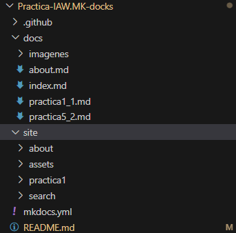
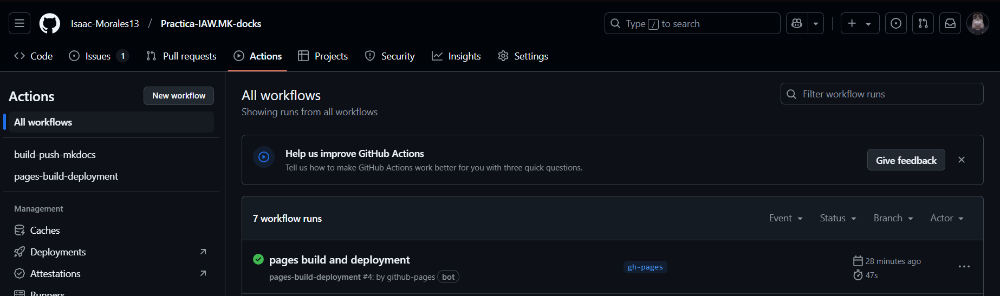
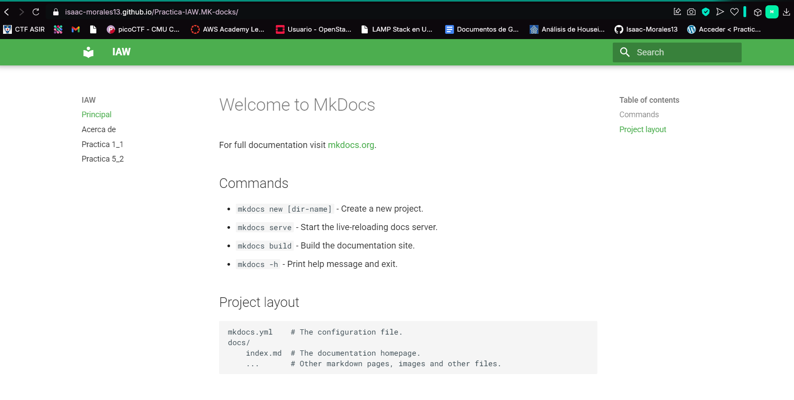
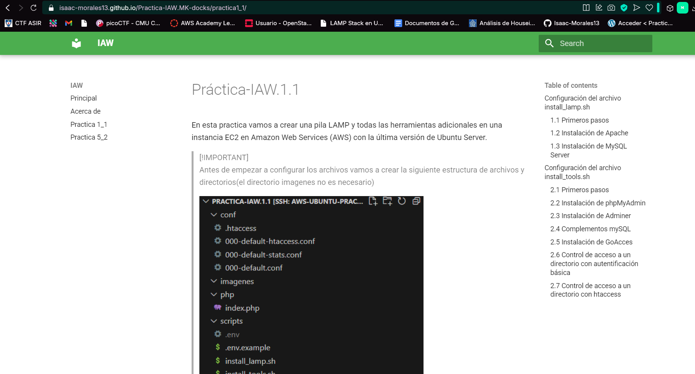

# Práctica: Creación de un sitio web estático con MkDocs y GitHub Pages
MkDocs es un generador de sitios web estáticos que nos permite crear de forma sencilla un sitio web para documentar un proyecto. El contenido del sitio web está escrito en texto plano en formato Markdown y se configura con un único archivo de configuración en formato YAML.


## Estructura del repositorio:



## Creamos el archivo mkdocs.yml

En este archivo definimos las paginas que servirá nuestro sitio y otros parametros como los colores

```bash
site_name: IAW

nav:
    - Principal: index.md
    - Acerca de: about.md
    - Practica 1_1: practica1_1
    - Practica 5_2: practica5_2

theme:
  name: material
  palette:
    primary: green
```

## Lanzamiento de contenedores

Una vez que hemos crado el archivo y añadido las paginas debemos lanzar los contenenedores que construiran el sitio y haran el despliegue en github sites

```
docker run --rm -it -p 8000:8000 --user $(id -u):$(id -g) -v "$PWD":/docs squidfunk/mkdocs-material build

docker run --rm -it -p 8000:8000 --user $(id -u):$(id -g) -v "$PWD":/docs squidfunk/mkdocs-material gh-deploy
```


Una vez ejecutados los contenedores se crea el sitio `https://isaac-morales13.github.io/Practica-IAW.MK-docks/`

## Automatizar la subida a github pages 

Podemos automatizar la subida con el siguiente workflow:

```bash
name: build-push-mkdocs

# Eventos que desescandenan el workflow
on:
  push:
    branches: ["main"]

  workflow_dispatch:

# A workflow run is made up of one or more jobs that can run sequentially or in parallel
jobs:

  # Job para crear la documentación de mkdocs
  build:
    # Indicamos que este job se ejecutará en una máquina virtual con la última versión de ubuntu
    runs-on: ubuntu-latest
    
    # Definimos los pasos de este job
    steps:
      - name: Clone repository
        uses: actions/checkout@v4

      - name: Install Python3
        uses: actions/setup-python@v4
        with:
          python-version: 3.x

      - name: Install Mkdocs
        run: |
          pip install mkdocs
          pip install mkdocs-material 

      - name: Build MkDocs
        run: |
          mkdocs build

      - name: Push the documentation in a branch
        uses: s0/git-publish-subdir-action@develop
        env:
          REPO: self
          BRANCH: gh-pages # The branch name where you want to push the assets
          FOLDER: site # The directory where your assets are generated
          GITHUB_TOKEN: ${{ secrets.GITHUB_TOKEN }} # GitHub will automatically add this - you don't need to bother getting a token
          MESSAGE: "Build: ({sha}) {msg}" # The commit message
```

Hacemos un commit de prueba y vemos que se ha subido



## Acceso al sitio

Ponemos en el navegador `https://isaac-morales13.github.io/Practica-IAW.MK-docks/` y vemos que se ha creado correctamente



Comprobamos que tambien se ha creado correctamente nuestras entradas


