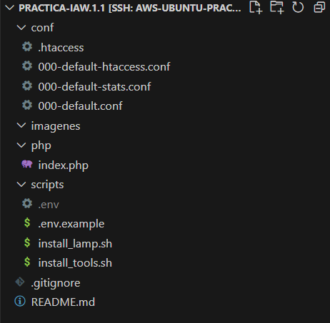
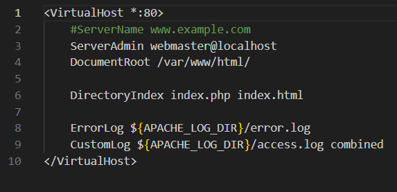
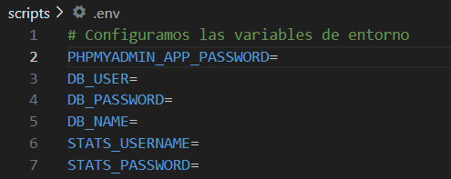
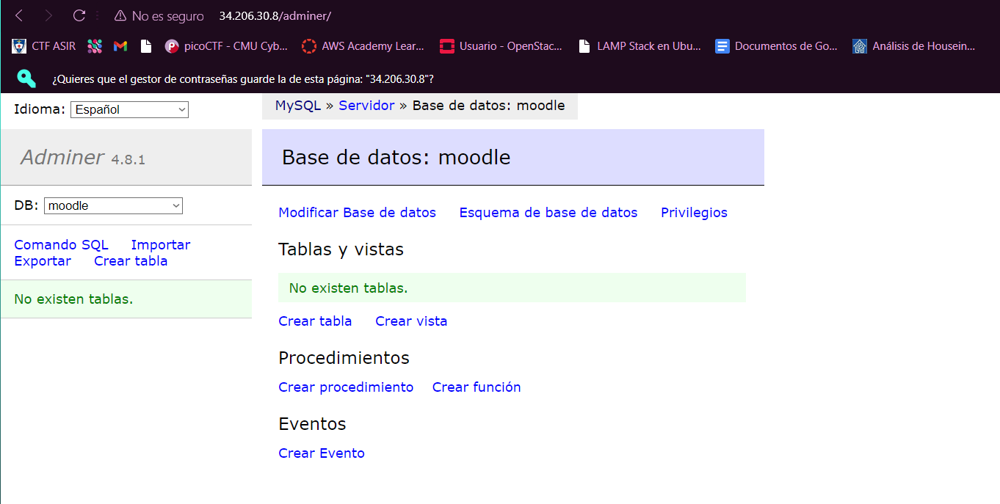
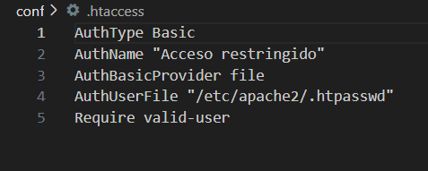

# Práctica-IAW.1.1
En esta practica vamos a crear una pila LAMP y todas las herramientas adicionales en una instancia EC2 en Amazon Web Services (AWS) con la última versión de Ubuntu Server.

> [!IMPORTANT]  
> Antes de empezar a configurar los archivos vamos a crear la siguiente estructura de archivos y directorios(el directorio imagenes no es necesario)
>
>

## Configuración del archivo `install_lamp.sh`
Vamos a empezar configurando el archivo `install_lamp`(script que normalmente se utiliza para automatizar la instalación y configuración de un servidor ). 
### 1.1 Primeros pasos
Lo primero que tenemos que hacer es poner lo siguiente:
```bash
#!/bin/bash

set -ex

apt update

apt upgrade -y
```

`#!/bin/bash:` Indica al sistema que intérprete debe usar para ejecutar el script

`set -ex:` El script se detendra en caso de error y además muestra comando antes de que sea ejecutado,

`apt update y upgrade:` Actualización de repositorios y paquetes. `-y` se usa para aceptar automaticamente las preguntas que nos pueden hacer en la actualización, lo que automatiza el proceso
### 1.2 Instalación de Apache
Ahora vamos a instalar Apache,un servidor web que nos permite alojar sitios aplicaciones en la web
```bash
apt install apache2 -y
``` 
Habilitamos el módulo rewrite, que permite reescribir las URLs y configurar reglas de redireccionamiento, para hacerlas  más amigables y mejorar el SEO de los sitios web.
```bash
a2enmod rewrite
``` 
> [!IMPORTANT]  
> Antes de seguir tenemos que tener configurado el archivo `000-default.conf` de esta forma:
>
>
>`DirectoryIndex:` Configura el orden prioridad de los archivos que se van a mostrar cuando se accede a un directorio
>
>`ErrorLog:` Establece la ubicación del archivo de registro donde se almacenarán los mensajes de error generados por el servidor.
>
> `Custom Log:` Define el archivo de registro de acceso donde se guardarán las solicitudes HTTP que recibe el servidor

Copiamos el archivo de configuración de Apache en la ruta `/etc/apache2/sites-available`
```bash
cp ../conf/000-default.conf /etc/apache2/sites-available
``` 
Instalamos PHP y algunos módulo para Apache y MySQL
```bash
apt install php libapache2-mod-php php-mysql -y
``` 
Creamos los directorios para alojar cada uno de los sitios web
```bash
 mkdir -p /var/www/html/web1
 mkdir -p /var/www/html/web2
``` 

Creamos los archivos de configuración para cada uno de los sitios web. Empezamos por el sitio web 1.
```bash
 nano /etc/apache2/sites-available/web1.conf
``` 
Una vez dentro añadimos esto
```bash
<VirtualHost *:80>
    ServerAdmin webmaster@web1.com
    ServerName web1.com
    DocumentRoot /var/www/html/web1
    ErrorLog ${APACHE_LOG_DIR}/error.log
    CustomLog ${APACHE_LOG_DIR}/access.log combined
</VirtualHost>
``` 
Hacemos los mismos pasos para la web 2 pero añadimos esto
```bash
<VirtualHost *:80>
    ServerAdmin webmaster@web2.com
    ServerName web2.com
    DocumentRoot /var/www/html/web2
    ErrorLog ${APACHE_LOG_DIR}/error.log
    CustomLog ${APACHE_LOG_DIR}/access.log combined
</VirtualHost>
``` 
Deshabilitamos el sitio virtual que viene por defecto 
```bash
sudo a2dissite 000-default.conf 
``` 
Y habilitamos los nuevos que hemos creado
```bash
sudo a2ensite web1.conf
sudo a2ensite web2.conf
``` 
Para que se aplique la nueva configuración es necesario ejecutar el comando
```bash
sudo systemctl reload apache2
``` 
Editamos el archivo /etc/hosts de nuestro equipo para resolver los nombres de dominio de forma local en nuestro entorno de desarrollo.
```bash
34.206.30.8   web1.com    
34.206.30.8  web2.com
``` 
>[!IMPORTANT]
>Antes de seguir tenemos que tener configurado el archivo index.php de esta forma:
>
>

Copiamos el script de prueba de PHP en /var/www/html
```bash
cp ../php/index.php /var/www/html
``` 
Modificamos el propietario y el grupo del archivo `index.php`
```bash
 chown -R www-data:www-data /var/www/htm
``` 
`-R:`Recursivo.Indica que el cambio de propietario debe aplicarse no solo al directorio especificado, sino también a todos los archivos y subdirectorios dentro de él

Hechas estas configuraciones si ponemos nuestra ip en algun navegador nos deberia salir esto


### 1.3 Instalación de MySQL Server
Ahora vamos a instalar el sistema gestor de bases de datos MySQL
```bash
apt install mysql-server -y
``` 
Una vez instalado podemos acceder a el mediante terminal


Despues de estas configuraciones y añadir algunos de los comandos al script, deberia quedar asi:
```bash
#!/bin/bash

# Configuramos para mostrar los comandos y finalizar si hay error
set -ex

# Actualizamos los repositorios
apt update

# Actualiza los paquetes
apt upgrade -y

# Instalamos el servidor web Apache
apt install apache2 -y

# Habilitamos el modulo rewrite
a2enmod rewrite

# Copiamos el archivo de configuración de Apache
cp ../conf/000-default.conf /etc/apache2/sites-available

# Instalamos PHP y algunos módulos de php para Apache y MySQL
apt install php libapache2-mod-php php-mysql -y

# Reiniciamos el servicio de Apache
systemctl restart apache2

# Instalamos MYSQL Server
 apt install mysql-server -y

# Copiamos el script de prueba de PHP en /var/www/html
cp ../php/index.php /var/www/html

# Modificamos el propietario y el grupo del archivo index.php
chown -R www-data:www-data /var/www/html
```
## Configuración del archivo `install_tools.sh`

Ahora vamos a configurar el archivo install_tools, que incluye herramientas necesarias para la instalación de la pila LAMP

### 2.1 Primeros pasos
Al igual que en el otro script, aquí tambien tendremos que poner lo siguiente:
```bash
#!/bin/bash

set -ex

apt update

apt upgrade -y
``` 

Hecho esto vamos a importar el archivo de variables para tener acceso a estas variables
```bash
 source .env
``` 
> [!IMPORTANT]  
> Estas variables no las tenemos en este script porque estan almacenadas en el archivo .gitignore, cuya función es especificar qué archivos o directorios deben ser ignorados por Git. El archivo .env que es el que almacena las contraseñas esta almacenado ahí  para proteger la intengridad de estos datos importantes
>
>
>
>El archivo env deberia contener algo parecido a esto pero con los valores de las variables(en la captura se han eliminado para proteger estos datos)
>
>

>[!TIP]
> Para poder saber las variables que se configura se hace un archivo llamado `env.example` en que ponemos las variables sin sus valores(este archivo si se guarda en git)
>

### 2.2 Instalación de phpMyAdmin

Automatizamos las respuestas de phpmyadmin cuando se está actualizando, evitando tener que añadirlo manualmente
```bash
echo "phpmyadmin phpmyadmin/reconfigure-webserver multiselect apache2" | debconf-set-selections
echo "phpmyadmin phpmyadmin/dbconfig-install boolean true" | debconf-set-selections
echo "phpmyadmin phpmyadmin/mysql/app-pass password $PHPMYADMIN_APP_PASSWORD" | debconf-set-selections
echo "phpmyadmin phpmyadmin/app-password-confirm password $PHPMYADMIN_APP_PASSWORD" | debconf-set-selections
``` 
Configuradas las respuestas pasamos a instalar phpMyAdmin
```bash
apt install phpmyadmin php-mbstring php-zip php-gd php-json php-curl -y
``` 

### 2.3 Instalación de Adminer
Ahora pasamos a instalar Adminer,una herramienta de gestión de bases de datos basada en web que permite a los usuarios administrar y manipular bases de datos de forma sencilla y eficiente

Creamos un directorio para Adminer
```bash
mkdir -p /var/www/html/adminer
``` 
`-p:`Indica la ruta donde queremos guardar el archivo

Descargamos Adminer
```bash
wget https://github.com/vrana/adminer/releases/download/v4.8.1/adminer-4.8.1-mysql.php -P /var/www/html/adminer
``` 

Renombramos el nombre del script de Adminer a uno más sencillo
```bash
mv /var/www/html/adminer/adminer-4.8.1-mysql.php /var/www/html/adminer/index.php
``` 
Modificamos el propietario y el grupo del archivo
```bash
chown -R www-data:www-data /var/www/html/adminer
``` 
Hecho esto deberia ir si ponemos nuestra ip/adminer en un buscador

### 2.4 Complementos mySQL
Vamos a crear una base de datos de ejemplo
```bash
mysql -u root <<< "DROP DATABASE IF EXISTS $DB_NAME"
mysql -u root <<< "CREATE DATABASE $DB_NAME"
``` 
Y un usuario para esta base de datos
```bash
mysql -u root <<< "DROP USER IF EXISTS '$DB_USER'@'%'"
mysql -u root <<< "CREATE USER '$DB_USER'@'%' IDENTIFIED BY '$DB_PASSWORD'"
mysql -u root <<< "GRANT ALL PRIVILEGES ON $DB_NAME.* TO '$DB_USER'@'%'"
``` 
Ahora si nos vamos a nuestra IP/phpmyadmin nos deberia salir algo parecido a esto:


### 2.5 Instalación de GoAcces
GoAccess es una herramienta de análisis de logs en tiempo real y de visualización de datos

Primero lo instalamos
```
apt install goaccess -y
``` 

Luego creamos un directorio para los informes estadisticos
```bash
mkdir -p /var/www/html/stats
``` 
Finalmente ejecutamos GoAcces en background
```
goaccess /var/log/apache2/access.log -o /var/www/html/stats/index.html --log-format=COMBINED --real-time-html --daemonize
``` 
`real-time-html:` Genera un informe que se actualiza en tiempo real

`daemonize:` Hace que se ejecute como un proceso en segundo plano

### 2.6 Control de acceso a un directorio con autentificación básica

> [!IMPORTANT]  
> Antes de seguir tenemos que tener configurado el archivo `000-default.stats.conf de esta manera`:


Copiamos el archivo default stats a /etc/apache2/sites-available
```bash
cp ../conf/000-default-stats.conf /etc/apache2/sites-available
``` 

Deshabilitamos el virtualhost que hay por defecto
```bash
a2dissite 000-default.conf
``` 

Habilitamos el nuevo Virtualhost
```bash
a2ensite 000-default-stats.conf
``` 

Hacemos un reload a apache
```bash
systemctl reload apache2
``` 
Creamos el archivo de contraseñas
```bash
htpasswd -bc /etc/apache2/.htpasswd $STATS_USERNAME $STATS_PASSWORD
``` 
`-bc:` Para poder incluir este comando en un script de bash,de este modo podemos indicarle el nombre del usuario y la contraseña como parámetros

### 2.7 Control de acceso a un directorio con htaccess
Htaccess permite realizar ajustes en la configuración del servidor sin necesidad de modificar el archivo de configuración principal de Apache

> [!IMPORTANT]  
> Antes de seguir tenemos que tener configurado el archivo `000-default-htaccess.conf`asi:
>
>

 Copiamos el archivo default-stats
 ```bash
cp ../conf/000-default-htaccess.conf /etc/apache2/sites-available
``` 

Deshabilitamos el virtualhost 000-default-stats.conf
 ```bash
a2dissite 000-default-stats.conf
``` 
Habilitamos el nuevo virtualhost 000-default-htaccess.conf
 ```bash
a2ensite 000-default-htaccess.conf
``` 
Hacemos un reload a apache
 ```bash
systemctl reload apache2
``` 
> [!IMPORTANT]  
> Antes de seguir tenemos que tener configurado el archivo `.htaccess` as:
>
>

Copiamos el archivo .htaccess a /var/www/html/stats para que al entrar a la web nos pida las credenciales 
 ```bash
cp ../conf/.htaccess /var/www/html/stats
``` 

Ahora si nos vamos a nuestra IP/stats nos pedirá que iniciemos sesión con nuestra credenciales


Una vez introducidas las credenciales tendremos acceso al panel de control


Ya tendriamos completo el script que quedaria tal que asi:
 ```bash
#!/bin/bash

# Importamos el archivo de variables
source .env

# Configuramos para mostrar los comandos y finalizar si hay error
set -ex

# Actualizamos los repositorios
apt update

# Actualiza los paquetes
apt upgrade -y

# Configuramos las respuestas para la instalación de phpMyAdmin
echo "phpmyadmin phpmyadmin/reconfigure-webserver multiselect apache2" | debconf-set-selections
echo "phpmyadmin phpmyadmin/dbconfig-install boolean true" | debconf-set-selections
echo "phpmyadmin phpmyadmin/mysql/app-pass password $PHPMYADMIN_APP_PASSWORD" | debconf-set-selections
echo "phpmyadmin phpmyadmin/app-password-confirm password $PHPMYADMIN_APP_PASSWORD" | debconf-set-selections

# Instalamos phpMyAdmin
apt install phpmyadmin php-mbstring php-zip php-gd php-json php-curl -y

#-----------------------------------------------------------------------------------------------------------------------
# Instalamos Adminer

# Paso 1. Creamos un directorio para Adminer
mkdir -p /var/www/html/adminer

# Paso 2. Descargamos Adminer
wget https://github.com/vrana/adminer/releases/download/v4.8.1/adminer-4.8.1-mysql.php -P /var/www/html/adminer

# Paso 3. Renombramos el nombre del script de Adminer
mv /var/www/html/adminer/adminer-4.8.1-mysql.php /var/www/html/adminer/index.php

# Paso 4. Modificamos el propietario y el grupo del archivo 
chown -R www-data:www-data /var/www/html/adminer

#------------------------------------------------------------------------------------------------------------------------------
# Creamos una base de datos de ejemplo
mysql -u root <<< "DROP DATABASE IF EXISTS $DB_NAME"
mysql -u root <<< "CREATE DATABASE $DB_NAME"

# Creamos un usuario para la base de datos de ejemplo
mysql -u root <<< "DROP USER IF EXISTS '$DB_USER'@'%'"
mysql -u root <<< "CREATE USER '$DB_USER'@'%' IDENTIFIED BY '$DB_PASSWORD'"
mysql -u root <<< "GRANT ALL PRIVILEGES ON $DB_NAME.* TO '$DB_USER'@'%'"

#--------------------------------------------------------------------------------------------------------------------------------
#Instalación GoAcces
apt install goaccess -y

# Creamos un directorio para los informes estadisticos
mkdir -p /var/www/html/stats

# Ejecutamos Goaccess en background
goaccess /var/log/apache2/access.log -o /var/www/html/stats/index.html --log-format=COMBINED --real-time-html --daemonize

#------------------------------------------------------------------------------------------------------------------------------
#Control de acceso a un directorio con autentificación básica
# Copiamos el archivo default stats

cp ../conf/000-default-stats.conf /etc/apache2/sites-available

# Deshabilitamos el virtualhost que hay por defecto
a2dissite 000-default.conf

# Habilitamos el nuevo Virtualhost
a2ensite 000-default-stats.conf

#Hacemos la configuración de apache
systemctl reload apache2

# Creamos el archivo de contraseñas
htpasswd -bc /etc/apache2/.htpasswd $STATS_USERNAME $STATS_PASSWORD

#------------------------------------------------------------------------------------------------------------------------------
#Control de acceso a un directorio con .htaccess
# Copiamos el archivo default-stats
cp ../conf/000-default-htaccess.conf /etc/apache2/sites-available

# Deshabilitamos el virtualhost 000-default-stats.conf
a2dissite 000-default-stats.conf

# Habilitamos el nuevo virtualhost 000-default-htaccess.conf
a2ensite 000-default-htaccess.conf

# Recargamos la configuracion de apache
systemctl reload apache2

# Copiamos el archivo .htaccess a /var/www/html/stats
cp ../conf/.htaccess /var/www/html/stats
``` 


