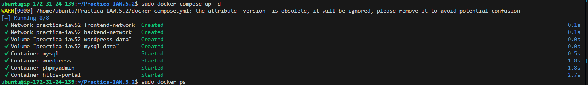
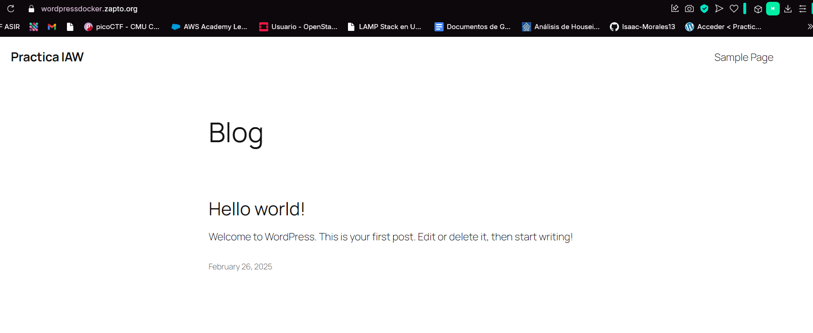
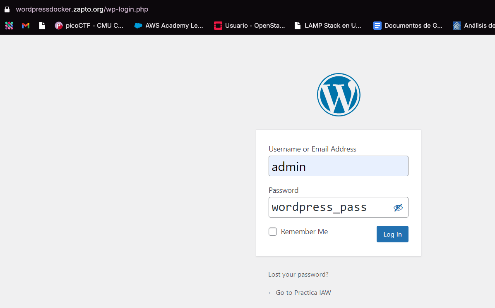
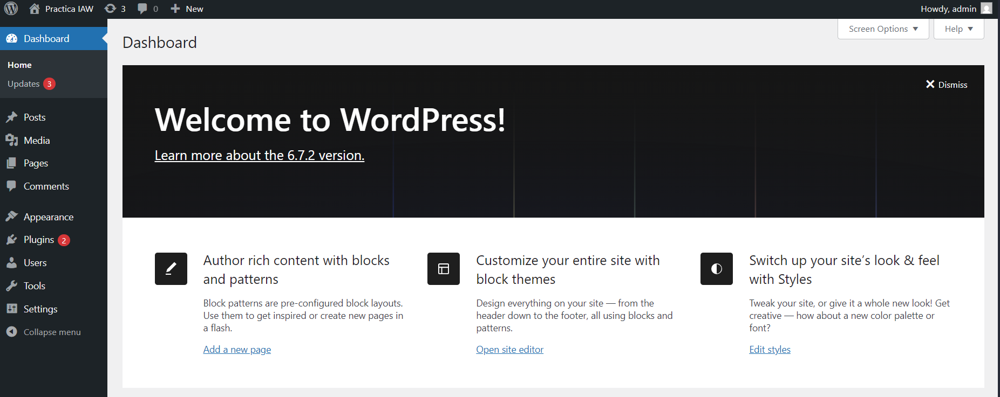

# Practica-IAW.5.2
## Despliegue de WordPress con Docker y Docker Compose

En esta práctica tendremos que realizar la implantación de un sitio WordPress en Amazon Web Services (AWS) haciendo uso de contenedores Docker y la herramienta Docker Compose

Comandos usados para levantar y apagar los contenedores:

` sudo docker compose up -d` 

` sudo docker compose down -v`

El .env lo configuramos de esta manera

``` bash
# Credenciales de MySQL
MYSQL_ROOT_PASSWORD=asir
MYSQL_DATABASE=wordpress_db
MYSQL_USER=wordpress_user
MYSQL_PASSWORD=wordpress_pass

# Configuración de WordPress
WORDPRESS_DATABASE_HOST=mysql
WORDPRESS_DATABASE_USER=wordpress_user
WORDPRESS_DATABASE_PASSWORD=wordpress_pass
WORDPRESS_DATABASE_NAME=wordpress_db
WORDPRESS_BLOG_NAME="Practica IAW"
WORDPRESS_USERNAME=admin
WORDPRESS_PASSWORD=wordpress_pass
WORDPRESS_EMAIL=demo@demo.es
``` 


y el docker-compose de esta


``` bash
version: '3.8'

services:
  wordpress:
    image: bitnami/wordpress:latest
    container_name: wordpress
    environment:
      WORDPRESS_DATABASE_HOST: ${WORDPRESS_DATABASE_HOST}
      WORDPRESS_DATABASE_USER: ${WORDPRESS_DATABASE_USER}
      WORDPRESS_DATABASE_PASSWORD: ${WORDPRESS_DATABASE_PASSWORD}
      WORDPRESS_DATABASE_NAME: ${WORDPRESS_DATABASE_NAME}
      WORDPRESS_BLOG_NAME: ${WORDPRESS_BLOG_NAME}
      WORDPRESS_USERNAME: ${WORDPRESS_USERNAME}
      WORDPRESS_PASSWORD: ${WORDPRESS_PASSWORD}
      WORDPRESS_EMAIL: ${WORDPRESS_EMAIL}
    volumes:
      - wordpress_data:/bitnami/wordpress
    depends_on:
      - mysql
    restart: always
    networks:
      - frontend-network
      - backend-network

  mysql:
    image: mysql:8.0
    container_name: mysql
    environment:
      MYSQL_ROOT_PASSWORD: ${MYSQL_ROOT_PASSWORD}
      MYSQL_DATABASE: ${MYSQL_DATABASE}
      MYSQL_USER: ${MYSQL_USER}
      MYSQL_PASSWORD: ${MYSQL_PASSWORD}
    volumes:
      - mysql_data:/var/lib/mysql
    networks:
      - backend-network
    restart: always

  phpmyadmin:
    image: phpmyadmin/phpmyadmin
    container_name: phpmyadmin
    ports:
      - "8080:80"
    environment:
      PMA_HOST: mysql
    networks:
      - frontend-network
    depends_on:
      - mysql
    restart: always

  https-portal:
    image: steveltn/https-portal:latest
    container_name: https-portal
    environment:
      DOMAINS: "wordpressdocker.zapto.org -> http://wordpress:8080"
      STAGE: "production"
    ports:
      - "80:80"
      - "443:443"
    networks:
      - frontend-network
    depends_on:
      - wordpress
    restart: always

networks:
  frontend-network:
  backend-network:

volumes:
  mysql_data:
  wordpress_data:
``` 

Ahora pongo a funcionar los contenedor y podemos acceder a wordpress







